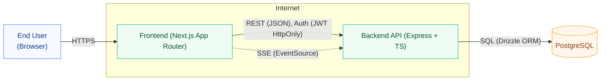
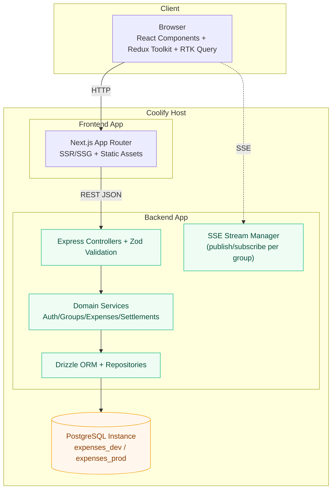
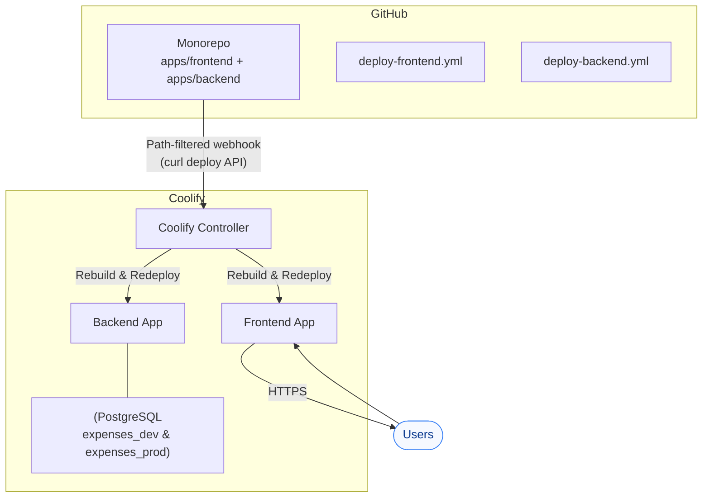
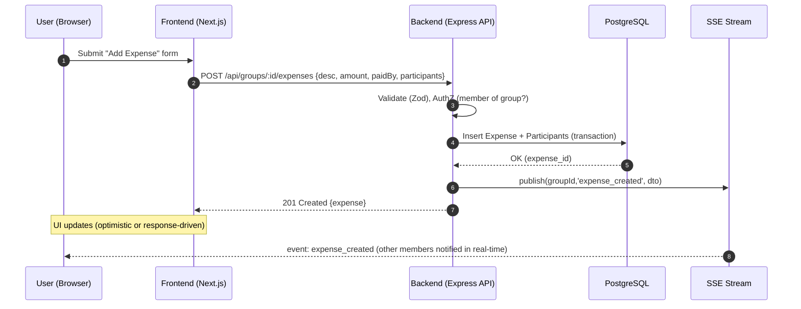
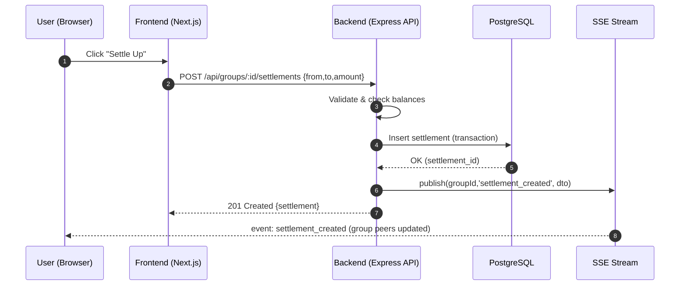

# High-Level Design (HLD) – Expense Split Calculator

This HLD captures the system context, containers, deployment topology, and key runtime interactions (request + realtime update flow). Diagrams are provided in **Mermaid** so you can view them in GitHub, VS Code, or any Mermaid renderer.

---

## 1) System Context (C4 Level 1)

**Notes**
- Users access the **Next.js** frontend which talks to the **Express** backend via REST and subscribes to **SSE** for realtime updates.
- The backend persists data in **PostgreSQL** through **Drizzle ORM** and emits SSE events to connected clients.

---

## 2) Container Diagram (C4 Level 2)

**Responsibilities**
- **API**: routing, validation, auth guards.
- **Services**: business logic (splits, balances, settlements).
- **DAL**: schema, migrations, queries.
- **SSE**: manages group streams, heartbeats, event fan-out.

---

## 3) Deployment Topology

**Key Points**
- Two independent Coolify applications (frontend/backend) enable **selective deploys**.
- One Postgres instance hosts **two databases**: `expenses_dev` and `expenses_prod` (separate credentials).

---

## 4) Runtime – Expense Creation Flow (Sequence)

---

## 5) Runtime – Settlement Flow (Sequence)

---

## 6) Cross-Cutting Concerns

- **Security**: bcrypt password hashing; JWT in HttpOnly cookies; CORS allow-list; input validation with Zod; least-privilege DB users.
- **Observability**: structured logs; request ids; basic health checks (`/health`).
- **SSE Hardening**: headers (`Content-Type: text/event-stream`, `X-Accel-Buffering: no`), 25s heartbeats, long proxy read timeouts.
- **Migrations**: Drizzle SQL migrations tracked in VCS; manual prod apply via container shell.
- **Backups**: Coolify Postgres daily backups before prod migrations.