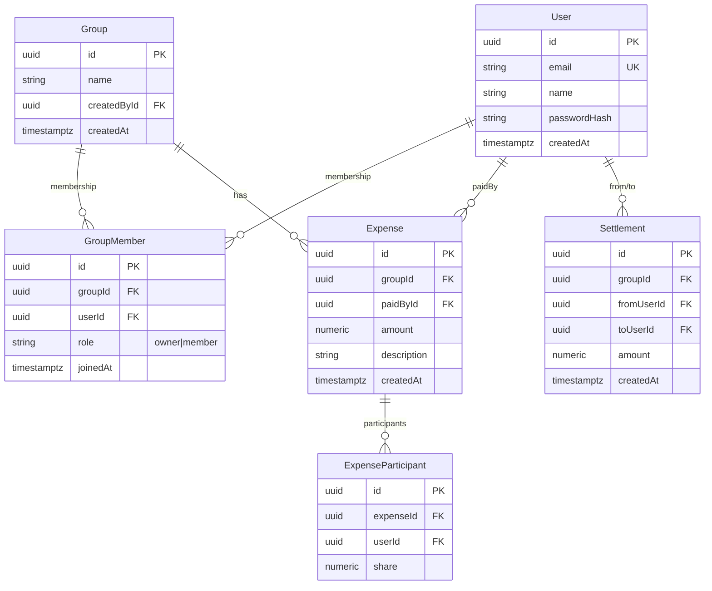
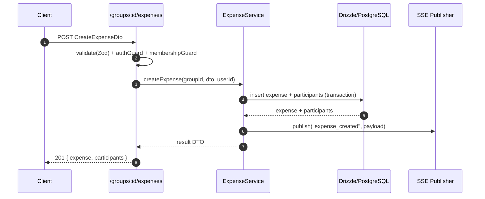
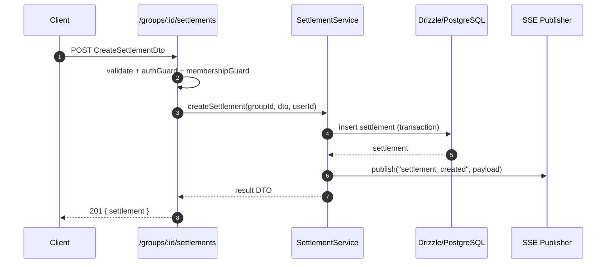

# Low-Level Design (LLD) – Expense Split Calculator

> Version: 1.0  
> Owner: Engineering  
> Status: Draft – Implementation-aligned

This LLD specifies module boundaries, data contracts (DTOs), validation schemas, API endpoints, error model, persistence schema, and runtime interactions for the Expense Split Calculator.

---

## 1. Scope

- Implements authentication, group membership, expense logging (equal split), settlements, and real-time updates via **Server-Sent Events (SSE)**.
- Database: **PostgreSQL** with **Drizzle ORM** and versioned SQL migrations.
- Frontend: **Next.js App Router** + **Redux Toolkit / RTK Query**.
- Backend: **Node.js + Express + TypeScript** with **Zod** validation.

> Out of scope (for v1): unequal split percentages, categories, notifications, multi-currency.

---

## 2. Directory Structure (Backend)

```
apps/backend/
  src/
    core/
      env.ts
      logger.ts
      errors.ts            # AppError, error middleware
      auth.ts              # JWT helpers
    db/
      schema.ts            # Drizzle table definitions
      client.ts            # pg Pool + drizzle db
      migrations/          # generated SQL
      applyMigrations.ts
    http/
      routes/
        index.ts
        auth.routes.ts
        users.routes.ts
        groups.routes.ts
        expenses.routes.ts
        settlements.routes.ts
        sse.routes.ts
      middleware/
        authGuard.ts
        validate.ts         # zod validator adapter
    modules/
      auth/
        service.ts
        dto.ts
      users/
        repo.ts
        service.ts
        dto.ts
      groups/
        repo.ts
        service.ts
        dto.ts
      expenses/
        repo.ts
        service.ts
        dto.ts
      settlements/
        repo.ts
        service.ts
        dto.ts
    realtime/
      sse.ts                # connection & publish
    index.ts                # express bootstrap
```

---

## 3. Data Model (Persistence)

### 3.1 ERD (implementation-focused)


### 3.2 Drizzle Table Sketch (TypeScript)
```ts
// src/db/schema.ts (excerpt)
import { pgTable, uuid, varchar, timestamp, numeric, uniqueIndex } from "drizzle-orm/pg-core";

export const users = pgTable("users", {
  id: uuid("id").primaryKey().defaultRandom(),
  email: varchar("email", { length: 255 }).notNull().unique(),
  name: varchar("name", { length: 120 }).notNull(),
  passwordHash: varchar("password_hash", { length: 255 }).notNull(),
  createdAt: timestamp("created_at", { withTimezone: true }).defaultNow(),
});

export const groups = pgTable("groups", {
  id: uuid("id").primaryKey().defaultRandom(),
  name: varchar("name", { length: 200 }).notNull(),
  createdById: uuid("created_by_id").notNull().references(() => users.id),
  createdAt: timestamp("created_at", { withTimezone: true }).defaultNow(),
});

export const groupMembers = pgTable("group_members", {
  id: uuid("id").primaryKey().defaultRandom(),
  groupId: uuid("group_id").notNull().references(() => groups.id),
  userId: uuid("user_id").notNull().references(() => users.id),
  role: varchar("role", { length: 20 }).notNull(), // "owner" | "member"
  joinedAt: timestamp("joined_at", { withTimezone: true }).defaultNow(),
}, (t) => ({
  uq: uniqueIndex("uq_group_user").on(t.groupId, t.userId),
}));

export const expenses = pgTable("expenses", {
  id: uuid("id").primaryKey().defaultRandom(),
  groupId: uuid("group_id").notNull().references(() => groups.id),
  paidById: uuid("paid_by_id").notNull().references(() => users.id),
  amount: numeric("amount", { precision: 12, scale: 2 }).notNull(),
  description: varchar("description", { length: 300 }).notNull(),
  createdAt: timestamp("created_at", { withTimezone: true }).defaultNow(),
});

export const expenseParticipants = pgTable("expense_participants", {
  id: uuid("id").primaryKey().defaultRandom(),
  expenseId: uuid("expense_id").notNull().references(() => expenses.id),
  userId: uuid("user_id").notNull().references(() => users.id),
  share: numeric("share", { precision: 12, scale: 2 }).notNull(),
}, (t) => ({
  uq: uniqueIndex("uq_expense_user").on(t.expenseId, t.userId),
}));

export const settlements = pgTable("settlements", {
  id: uuid("id").primaryKey().defaultRandom(),
  groupId: uuid("group_id").notNull().references(() => groups.id),
  fromUserId: uuid("from_user_id").notNull().references(() => users.id),
  toUserId: uuid("to_user_id").notNull().references(() => users.id),
  amount: numeric("amount", { precision: 12, scale: 2 }).notNull(),
  createdAt: timestamp("created_at", { withTimezone: true }).defaultNow(),
});
```

### 3.3 Index Strategy
- `users(email)` unique.
- `group_members(group_id, user_id)` unique.
- `expenses(group_id, created_at)` (list + sort).
- `expense_participants(expense_id, user_id)` unique.
- `settlements(group_id, created_at)` (history).

---

## 4. Data Contracts (DTOs) & Validation (Zod)

### 4.1 Common Types
```ts
type UUID = string; // v4
type Money = string; // decimal as string to avoid FP errors
```

### 4.2 Auth
```ts
// modules/auth/dto.ts
import { z } from "zod";

export const RegisterDto = z.object({
  email: z.string().email(),
  name: z.string().min(2).max(120),
  password: z.string().min(8).max(128),
});
export type RegisterDto = z.infer<typeof RegisterDto>;

export const LoginDto = z.object({
  email: z.string().email(),
  password: z.string().min(8).max(128),
});
export type LoginDto = z.infer<typeof LoginDto>;
```

### 4.3 Groups
```ts
export const CreateGroupDto = z.object({
  name: z.string().min(2).max(200),
});
export const InviteDto = z.object({
  userId: z.string().uuid(),
});
```

### 4.4 Expenses
```ts
export const CreateExpenseDto = z.object({
  description: z.string().min(1).max(300),
  amount: z.string().regex(/^\d+(\.\d{1,2})?$/), // Money
  paidById: z.string().uuid(),
  participants: z.array(z.string().uuid()).min(1),
  split: z.literal("equal").default("equal"),
});
```

### 4.5 Settlements
```ts
export const CreateSettlementDto = z.object({
  fromUserId: z.string().uuid(),
  toUserId: z.string().uuid(),
  amount: z.string().regex(/^\d+(\.\d{1,2})?$/),
});
```

### 4.6 Error Model
```json
{
  "error": {
    "code": "string",       // e.g., "VALIDATION_ERROR", "UNAUTHORIZED", "FORBIDDEN", "NOT_FOUND", "CONFLICT"
    "message": "human readable",
    "details": { "field": "issue" } // optional
  }
}
```

---

## 5. API Endpoints

> Base URL: `/api`

### 5.1 Auth
- `POST /auth/register`  
  - Body: `RegisterDto`  
  - 201 → `{ id, email, name }` (sets auth cookie)  
  - 409 if email exists

- `POST /auth/login`  
  - Body: `LoginDto`  
  - 200 → `{ id, email, name }` (sets auth cookie)  
  - 401 invalid credentials

- `POST /auth/logout`  
  - 204, clears cookie

- `GET /auth/me`  
  - 200 → `{ id, email, name }`  
  - 401 if not logged in

### 5.2 Users
- `GET /users/search?query=`  
  - 200 → list of `{ id, email, name }` (for inviting)

### 5.3 Groups
- `POST /groups` (auth required)  
  - Body: `CreateGroupDto`  
  - 201 → `{ id, name, members: [{id, name}], createdAt }` (caller becomes owner & member)

- `POST /groups/:groupId/invite` (owner or member)  
  - Body: `InviteDto`  
  - 204 (idempotent: if already member, no-op)

- `GET /groups/:groupId` (member)  
  - 200 → `{ group, members, expenses, settlements, balances }`

- `GET /groups/:groupId/balances` (member)  
  - 200 → `{ [userId]: Money }` (positive = owed to user, negative = user owes)

### 5.4 Expenses
- `POST /groups/:groupId/expenses` (member)  
  - Body: `CreateExpenseDto`  
  - 201 → `{ expense, participants }`  
  - Side-effect: publish SSE `expense_created`

- `GET /groups/:groupId/expenses` (member)  
  - 200 → `Expense[]` with participants

### 5.5 Settlements
- `POST /groups/:groupId/settlements` (member)  
  - Body: `CreateSettlementDto`  
  - 201 → `{ settlement }`  
  - Side-effect: publish SSE `settlement_created`

- `GET /groups/:groupId/settlements` (member)  
  - 200 → `Settlement[]`

### 5.6 SSE
- `GET /groups/:groupId/stream` (member)  
  - Headers: `Content-Type: text/event-stream`, `Cache-Control: no-cache, no-transform`, `Connection: keep-alive`, `X-Accel-Buffering: no`  
  - Events:  
    - `expense_created` → `{ expense, participants }`  
    - `settlement_created` → `{ settlement }`  
  - Heartbeat: `:\n\n` every 25s

---

## 6. Authorization Matrix (Summary)

| Endpoint | Role | Rule |
|---------|------|------|
| `/auth/*` | Public | Register/Login allowed |
| `/groups` `POST` | Authenticated | Any user can create |
| `/groups/:id/invite` `POST` | Member | Must be member of `:id` |
| `/groups/:id` `GET` | Member | Must be member |
| `/groups/:id/expenses*` | Member | Must be member |
| `/groups/:id/settlements*` | Member | Must be member |
| `/groups/:id/stream` | Member | Must be member |

- **Membership check** performed by `authGuard + membershipGuard` middleware.

---

## 7. Business Logic

### 7.1 Equal Split Calculation
Given `amount` and `participants` (N):
```
share_per_user = round2(amount / N)
# last participant adjusted to ensure sum(shares) == amount
last_share = amount - share_per_user*(N-1)
```

### 7.2 Balance Computation (per group)
- For each expense:
  - Payer balance += amount - payer_share
  - Each participant balance -= share (except the payer, who gets payer_share subtracted accordingly)
- For each settlement:
  - fromUser balance += amount (they paid their debt)
  - toUser balance -= amount
- Result: `{ [userId]: Money }`

> Balances are **derived**, not stored, to avoid drift and preserve normalization.

### 7.3 Edge Cases
- Participant list must include payer if they participated (equal split expects inclusion). If not, payer share = 0.
- Zero or negative amounts rejected.
- Round to 2 decimals; fix residual on last participant to maintain invariant.

---

## 8. Realtime (SSE) Contract

### 8.1 Event Types
```ts
type ExpenseCreatedEvt = {
  type: "expense_created";
  groupId: UUID;
  expense: {
    id: UUID; description: string; amount: Money; paidById: UUID; createdAt: string;
  };
  participants: Array<{ userId: UUID; share: Money }>;
};

type SettlementCreatedEvt = {
  type: "settlement_created";
  groupId: UUID;
  settlement: { id: UUID; fromUserId: UUID; toUserId: UUID; amount: Money; createdAt: string };
};
```

### 8.2 Delivery
- One **EventSource** per group: `/groups/:id/stream`.
- Server sends:
```
event: expense_created
data: { ...json... }

event: settlement_created
data: { ...json... }
```
- Heartbeat every 25s: `:\n\n`
- Clients reconnect automatically; no `Last-Event-ID` in v1.

---

## 9. Express Middleware & Error Handling

- `authGuard`: verify JWT from HttpOnly cookie; attach `req.user`.
- `membershipGuard(groupParam)`: ensures `req.user.id` is in `group_members` for the given `:groupId`.
- `validate(schema)`: wraps Zod schemas for request body/params/query.
- `errorHandler`: maps domain/app errors → `error.code`, `status`:
  - `VALIDATION_ERROR` → 400
  - `UNAUTHORIZED` → 401
  - `FORBIDDEN` → 403
  - `NOT_FOUND` → 404
  - `CONFLICT` → 409
  - `INTERNAL` → 500

---

## 10. Logging & Observability

- **Request ID** per request (e.g., `x-request-id`).
- Structured logs (JSON) with level (`info|warn|error`), module, requestId.
- Health endpoint: `GET /health` returns `{ status: "ok", time }`.
- Minimal metrics (optional): request counts, error rates.

---

## 11. Configuration

- `.env` variables:
  - `PORT`, `DATABASE_URL`, `JWT_SECRET`, `CORS_ORIGIN`, `NODE_ENV`
- `CORS`:
  - allow origin = frontend URL
  - allow credentials = true
- Cookies:
  - `HttpOnly`, `Secure` (on HTTPS), `SameSite=Lax`

---

## 12. Testing Plan

- **Unit**:
  - split algorithm (rounding, last-share correction)
  - balance aggregation (expenses + settlements)
- **API** (Supertest):
  - `/auth/register|login|me`
  - `/groups` create + invite
  - `/expenses` create + list
  - `/settlements` create + list
- **Integration**:
  - SSE: upon creating expense, connected client receives `expense_created`

---

## 13. Sequence Diagrams (LLD Level)

### 13.1 Create Expense (with validation and publish)


### 13.2 Settle Up


---

## 14. Non-Functional Requirements (mapped)

- **Security**: bcrypt, JWT HttpOnly, Zod validation, least-privilege DB users.
- **Reliability**: derived balances; transactions for expense/participant inserts.
- **Performance**: indexes for hot paths; pagination for lists (future).
- **Scalability**: stateless API; SSE fan-out per group in-memory (can swap to Redis pub/sub later).
- **Maintainability**: modular services, typed DTOs, migrations under VCS.
- **Observability**: structured logs, health checks.

---

## 15. Risks & Mitigations

- **SSE proxy buffering** → set `X-Accel-Buffering: no`, heartbeat 25s, long timeouts.
- **FP rounding errors** → store money as `numeric(12,2)`; accept input as string; centralize rounding.
- **Drifted balances** → compute derived balances; no denormalized balance columns.
- **Prod migration safety** → manual trigger; backups before apply; review SQL.

---

## 16. Open Points / Future Work

- Unequal splits and percentages.
- Expense categories + monthly summaries.
- Notification system.
- `Last-Event-ID` for SSE resume.
- Role-based permissions beyond owner/member.

---

## 17. Glossary

- **DTO**: Data Transfer Object – typed payload between layers.
- **Zod**: TS-first schema & validation.
- **SSE**: Server-Sent Events – one-way, server→client streaming over HTTP.
- **Drizzle**: TypeScript ORM generating SQL migrations.